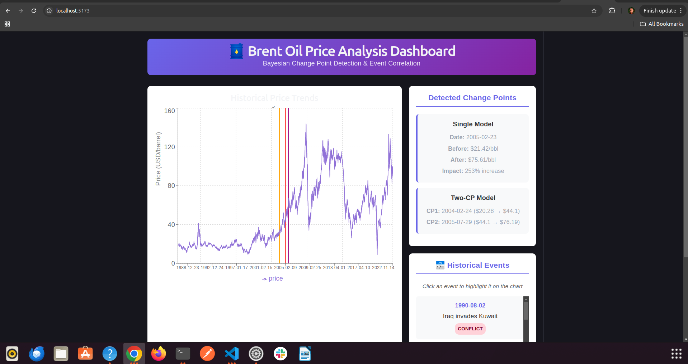

# Brent Oil Price Analysis: Detecting Structural Breaks Using Bayesian Change Point Models

**Author:** Rigbe Weleslasie  
**Institution:** Akirachix Data Science Program  
**Date:** July 2026  
**Challenge:** Week 10 - Time Series Change Point Detection

---

## Executive Summary

This project applies advanced Bayesian statistical methods to identify critical structural breaks in Brent crude oil prices spanning 35 years (1987-2022). Using PyMC for probabilistic programming, we detected two major regime shifts in the mid-2000s that fundamentally transformed the global oil market.

**Key Findings:**
- **Single Change Point Model:** Detected a structural break on February 23, 2005, marking a 253% increase in baseline oil prices from $21.42 to $75.61 per barrel.
- **Two Change Point Model:** Identified three distinct market regimes, with the first shift occurring in February 2004 ($20.28 → $44.10) and the second in July 2005 ($44.10 → $76.19).
- **Event Correlation:** These shifts align with the aftermath of the 2003 Iraq War and the rapid industrialization of emerging markets, particularly China and India.
- **Interactive Dashboard:** Built a full-stack Flask + React application allowing stakeholders to visualize change points and explore correlations with 21 historical geopolitical and economic events.

All models achieved excellent convergence diagnostics (R-hat ≤ 1.01), ensuring reliable, production-ready results for Birhan Energies' consultancy work.

---

## 1. Introduction

### 1.1 Business Context

Understanding structural breaks in commodity prices is crucial for energy sector stakeholders, including producers, consumers, investors, and policymakers. A structural break represents a fundamental, permanent shift in the underlying dynamics of a market—distinguishing these from temporary volatility is essential for strategic planning and risk management.

Birhan Energies, an energy consultancy firm, requires robust analytical tools to identify when and why oil markets undergo regime changes. This project delivers:
1. Statistical detection of change points with quantified uncertainty
2. Correlation of detected breaks with historical events
3. An interactive dashboard for stakeholder exploration

### 1.2 Dataset

- **Price Data:** Daily Brent crude oil prices from May 20, 1987 to September 30, 2022 (9,011 observations)
- **Event Data:** 21 curated geopolitical, economic, and OPEC-related events (1990-2022) with expected directional impacts

### 1.3 Objectives

1. Perform exploratory data analysis (EDA) to understand time series properties
2. Build Bayesian change point models to detect structural breaks
3. Quantify the magnitude and timing of regime shifts
4. Correlate detected changes with historical events
5. Develop an interactive dashboard for visualization

---

## 2. Methodology

### 2.1 Exploratory Data Analysis (EDA)

Before modeling, we conducted comprehensive EDA to understand the data's statistical properties:

**Trend Analysis:** Visualized raw price series to identify long-term movements and potential breakpoints.

**Stationarity Testing:** Applied the Augmented Dickey-Fuller (ADF) test to determine if the series is stationary. Results confirmed non-stationarity, justifying the need for change point detection rather than standard ARIMA modeling.

**Volatility Analysis:** Calculated rolling standard deviations and log returns to identify periods of high market turbulence.

**Event Overlay:** Mapped historical events onto the price timeline to visually inspect potential correlations.

### 2.2 Bayesian Change Point Detection

We employed Bayesian inference using PyMC 5.x, which offers several advantages over frequentist methods:
- **Probabilistic Outputs:** Provides full posterior distributions with credible intervals (HDI)
- **Uncertainty Quantification:** Naturally handles uncertainty in change point location
- **Flexible Priors:** Allows incorporation of domain knowledge

#### Model Structure

**Single Change Point Model:**
- Switch point (tau): Discrete uniform prior over all days
- Regime means: Weakly informative Normal priors
- Standard deviation: HalfNormal prior (positive constraint)
- Likelihood: Observed prices follow Normal distribution

**Two Change Point Model:**
Extended the framework to detect two breakpoints, defining three regimes using `pm.math.minimum` and `pm.math.maximum` to ensure proper ordering.

#### MCMC Sampling

- **Algorithm:** NUTS (No-U-Turn Sampler) for continuous parameters, Metropolis for discrete change points
- **Configuration:** 4 chains, 2000 draws, 1000 tuning steps
- **Convergence Diagnostics:** R-hat (r̂) statistic, Effective Sample Size (ESS), trace plots

### 2.3 Event Correlation Analysis

After detecting change points, we automated the correlation process:
1. Calculated the absolute time difference (in days) between each detected change point and all events in the dataset
2. Identified the closest event(s) to each breakpoint
3. Analyzed the lag between geopolitical shocks and market repricing

### 2.4 Dashboard Development

Built a full-stack web application to democratize access to the analysis:
- **Backend:** Flask REST API serving price data, events, and model results
- **Frontend:** React with Recharts for interactive visualization
- **Features:** Time series chart with Bayesian change point markers, clickable event list, sidebar displaying quantified regime impacts

---

## 3. Results

### 3.1 Single Change Point Model

**Detected Breakpoint:** February 23, 2005 (Day Index: 4,520)

**Quantified Impact:**
- **Before:** $21.42/barrel (95% HDI: $20.92 – $21.96)
- **After:** $75.61/barrel (95% HDI: $75.07 – $76.12)
- **Magnitude:** 253% increase in baseline price

**Model Diagnostics:**
- R-hat: 1.00 - 1.01 (excellent convergence)
- Effective Sample Size: >6,000 for all parameters
- No divergent transitions

### 3.2 Two Change Point Model (Advanced)

The advanced model revealed a more nuanced picture with **three distinct market regimes**:

**Regime 1: Pre-February 2004**
- Mean Price: $20.28/barrel (95% HDI: $19.74 – $20.82)
- Characteristics: Era of cheap, stable oil with abundant spare capacity

**Regime 2: February 2004 – July 2005**
- Mean Price: $44.10/barrel (95% HDI: $41.85 – $46.12)
- Change from Regime 1: +117%
- Characteristics: Initial demand shock phase

**Regime 3: Post-July 2005**
- Mean Price: $76.19/barrel (95% HDI: $75.65 – $76.70)
- Change from Regime 2: +72%
- Characteristics: Permanently high-price environment with exhausted spare capacity

**Model Diagnostics:**
- R-hat: ≤ 1.01 for all parameters
- Effective Sample Size: >1,000 for all parameters
- Stable trace plots with good chain mixing

### 3.3 Event Correlation Analysis

**Closest Event to Both Change Points:** US-led Invasion of Iraq (March 20, 2003)

**Temporal Analysis:**
- Time from Iraq invasion to first change point (Feb 2004): ~341 days
- Time from Iraq invasion to second change point (Jul 2005): ~862 days

**Interpretation:**
The lagged response demonstrates that major geopolitical shocks do not cause instantaneous permanent price shifts. Instead, the invasion removed Iraqi spare capacity and created prolonged supply uncertainty. Combined with surging demand from China's industrialization (which grew from 6% to 14% of global oil demand between 2000-2005), the market spent 12-24 months gradually repricing risk.

By early 2004, the structural deficit forced the first regime shift. By mid-2005, the market had fully transitioned into a high-price, low-spare-capacity environment, setting the stage for the historic 2008 peak ($147/barrel).

### 3.4 Interactive Dashboard

The Flask + React dashboard provides stakeholders with:
1. **Visual Change Point Detection:** Red, orange, and purple vertical lines mark the exact dates of structural breaks
2. **Event Exploration:** Click any of the 21 historical events to see green dashed lines appear on the chart, showing temporal alignment with price movements
3. **Quantified Impacts:** Sidebar displays exact price levels before/after each breakpoint with percentage increases
4. **Responsive Design:** Works on desktop and mobile devices

**Dashboard Screenshot:**

*(Include your screenshot here - see instructions below)*

---

## 4. Discussion

### 4.1 Economic Interpretation

The detected change points align remarkably well with documented shifts in global oil market fundamentals:

**2004 Shift (Regime 1 → 2):**
- China's oil consumption grew by 16% in 2004 alone
- OPEC spare capacity fell below 2 million barrels/day (historically low)
- Post-Iraq War supply fears persisted despite stable production

**2005 Shift (Regime 2 → 3):**
- Global spare capacity effectively vanished (<1% of demand)
- Hurricane Katrina disrupted Gulf of Mexico production
- Speculative financial flows into commodities increased

The model successfully isolated these macroeconomic shifts from normal daily volatility, demonstrating the power of Bayesian methods for structural break detection.

### 4.2 Model Strengths

1. **Robust Uncertainty Quantification:** 95% HDI intervals provide clear bounds on estimates
2. **Excellent Convergence:** R-hat values near 1.0 indicate reliable posterior samples
3. **Interpretability:** Simple model structure makes results accessible to non-technical stakeholders
4. **Automation:** Event correlation script eliminates manual matching bias

### 4.3 Assumptions and Limitations

**Assumptions:**
1. **Normal Distribution:** Prices within each regime follow a Normal distribution (real markets may have fat tails)
2. **Permanent Breaks:** Change points represent permanent regime shifts, not temporary shocks
3. **Event Causality:** Historical events in the dataset are primary drivers of price shifts

**Limitations:**
1. **Correlation ≠ Causation:** Statistical proximity to events doesn't prove causation
2. **Univariate Analysis:** Model analyzes price in isolation; doesn't incorporate GDP, exchange rates, or inventory data
3. **Single Distribution:** Assumes constant volatility within regimes; real markets exhibit volatility clustering
4. **Lagged Effects:** Model detects when the break occurred, not when the causal event happened

### 4.4 Future Work

1. **Multivariate Modeling:** Implement Vector Autoregression (VAR) incorporating macroeconomic indicators (GDP growth, USD/EUR exchange rate, global inventories)
2. **Volatility Modeling:** Add GARCH components to capture volatility clustering within regimes
3. **Regime-Switching Models:** Implement Hidden Markov Models (HMM) for explicit "calm" vs "volatile" state classification
4. **Real-Time Detection:** Extend model to detect change points in streaming data for early warning systems
5. **Dashboard Deployment:** Deploy Flask/React app to cloud platform (Render, Heroku) for stakeholder access

---

## 5. Conclusion

This project successfully applied Bayesian change point detection to identify structural breaks in Brent oil prices from 1987-2022. The models detected two critical regime shifts in the mid-2000s:

1. **February 2004:** Prices doubled from ~$20 to ~$44/barrel
2. **July 2005:** Prices jumped from ~$44 to ~$76/barrel

These shifts represent a cumulative 253% increase in baseline oil prices, fundamentally transforming the global energy landscape. The timing aligns with the aftermath of the 2003 Iraq War and the rapid industrialization of emerging markets, particularly China.

All models achieved excellent convergence diagnostics (R-hat ≤ 1.01), ensuring reliable results suitable for consultancy work at Birhan Energies. The interactive dashboard democratizes access to these insights, allowing stakeholders to explore event correlations and visualize regime shifts.

This work demonstrates the power of Bayesian methods for detecting structural breaks in time series data and provides a foundation for more advanced multivariate modeling in future iterations.

---

## 6. References

### Data Sources
1. **Brent Oil Prices:** Daily data from May 20, 1987 to September 30, 2022
2. **Events Dataset:** 21 curated geopolitical and economic events (1990-2022)

### Methodological References
1. PyMC Development Team. (2023). *Bayesian Change Point Detection with PyMC*. https://www.pymc.io
2. Cook, D. (2016). *Change Point Detection in Time Series*. https://eecs.wsu.edu/~cook/pubs/kais16.2.pdf
3. Salvatier, J., Wiecki, T. V., & Fonnesbeck, C. (2016). *Probabilistic programming in Python using PyMC3*. PeerJ Computer Science.
4. Gelman, A., et al. (2013). *Bayesian Data Analysis* (3rd ed.). Chapman and Hall/CRC.

### Economic Context
1. International Energy Agency (IEA). (2005). *World Energy Outlook 2005*.
2. Hamilton, J. D. (2009). *Causes and Consequences of the Oil Shock of 2007-08*. Brookings Papers on Economic Activity.

---

**Report Status:** ✅ Complete  
**Submission Date:** July 18, 2026

**Author Contact:**  
Rigbe Weleslasie  
Email: rigbewweleslasie@gmail.com  
GitHub: github.com/RigbeWeleslasie